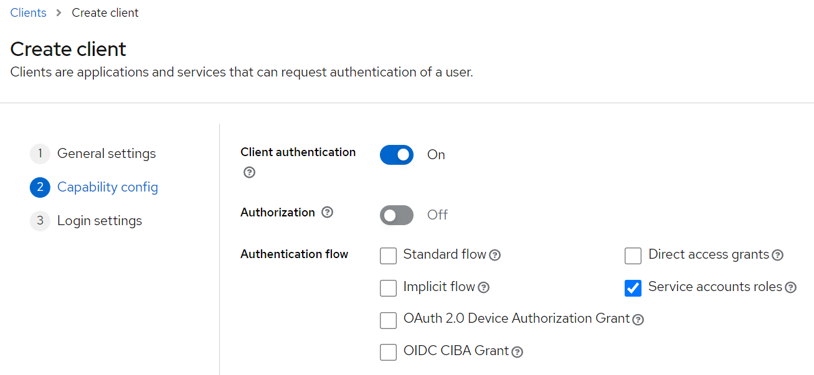
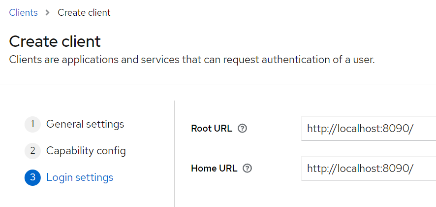

# microservice-security-keycloak

Simple microservice app using:

- Spring cloud gateway
- Service discovery using Netflix eureka
- Keycloak for authentication

Ref: https://www.youtube.com/watch?v=KpITcN7O53Y

My Postman collection: microservice-security-keycloak

## Prerequisites

This tutorial is the next series after the [jwt-apigateway-security](https://github.com/anhtuta/jwt-apigateway-security) tutorial. Please check it first for better understanding

Also, the source code of this project is cloned from the `jwt-apigateway-security` as well

## Setup flow

### Keycloak (Authorization Server)

Download keycloak, run it. By default, it will start on port 8080:

- `cd Programs/keycloak-23.0.3`
- `bin/kc.sh start-dev`

Then go to keycloak console http://localhost:8080/ and add a new realm: `microservice-security-keycloak`

Select that realm, then create a new client:

- Client ID: `microservice-auth`
- Name: `microservice-auth`
- Description: `microservice-auth`

Then click next, then config capability like following:



Then click next, then config login, these are URL of the API gateway (`swiggy-gateway`)



Save it, after that, go to the `Credentials` tab to get the client secret

Go to the realm settings to get all configs: http://localhost:8080/admin/master/console/#/microservice-security-keycloak/realm-settings. We need these following values:

```
{
  "issuer": "http://localhost:8080/realms/microservice-security-keycloak",
  "token_endpoint": "http://localhost:8080/realms/microservice-security-keycloak/protocol/openid-connect/token"
}
```

### Api gateway (Resource Server)

Now, the API gateway doesn't need the `identity-service` anymore. Instead, it will delegate to the keycloak for authentication, so we can remove the `identity-service` and the filter

We also need to add resource server dependency for this service, and add the issuer-uri configuration to point to keycloak (this config can be found on [spring docs](https://docs.spring.io/spring-security/reference/servlet/oauth2/resource-server/jwt.html)):

```yml
spring:
  security:
    oauth2:
      resourceserver:
        jwt:
          # Value of this taken from keycloak above
          issuer-uri: http://localhost:8080/realms/microservice-security-keycloak
```

The spring docs also mentions that: keycloak in this case is the Authorization server, and API gateway is the Resource server

## Testing flow

- Start the service registry first, then start all other services
- Send request with clientId, clientSecret to keycloak to authenticate and get a token
- Use that token to send request to API gateway to access resource

Please check my postman collection: microservice-security-keycloak
